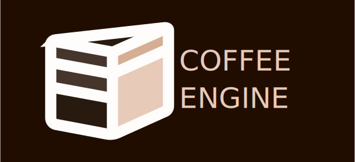

</img>
Coffee Engine is a free and open-source game engine made in javascript. Its goal is to be a usable, versatile, customizable, and portable engine!

## Quirks of the engine

The engine has some quirks while working on its source, which contributors might have to get used to.

### Modules and Packages

Keep them to a minimum, no modules besides compilation, because this engine has to be portable, without a server. 
I reccomend staying with what we have which are :

- Blockly
- Monaco
- Marked (v15.0.0)

### Node-based before everything

The engine's new focus is to have a node-based object system, but with the simplicity to be easy for beginners.

### Customizability is key

Coffee Engine should be very customizable with almost everything being able to be moved around or changed in some way.

## Contributing

you can use `node build.mjs` to build a non-Browser version of the engine, when building it should show a little command line tool for you to mess around with.
if you just want to test on a browser, use a local server

### And about IOS Safari?

no, if you find a fix for safari, commit it.

## Forking

If you plan to make a fork or mod of the engine please add some link back to the original engine! This is not a requirement just a simple request.

  I like these badge things 
  </img>
  </img>
  </img>
  </img>

